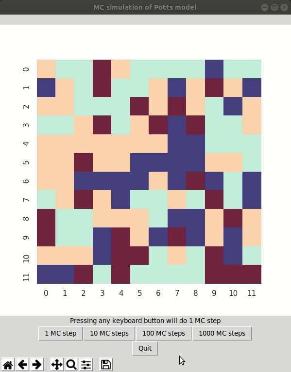

# Potts model Monte Carlo simulation
Simulation of the Potts model for a university course in Monte Carlo simulations

## Preview


## Install dependencies
You need need Python3 with Tkinter and PIP.
On Ubuntu 18.04, you can get them by typing (with sudo rights):

```bash
apt install python3 python3-tk python3-pip python3-dev 
```

Create a virtual environment to install the packages dependencies and 
Poetry dependency manager:
```bash
python3 -m venv potts-venv
source potts-venv/bin/activate
pip install poetry
```

Then use Poetry to install the necessary Python dependencies (via virtualenv and pip):
```bash
poetry install
``` 

## Run GUI of Potts simulation
With the virtual environment still activated (`source potts-venv/bin/activate`), call
```bash
python main.py
```

## TODO
* Add magnetization term
* Add temperature to GUI
* Speed up metropolis algorithm

## Further ideas
* Add changeable boundary conditions
* Make parameters (e. g. magnetization coefficient) changeable in GUI
* Add simulation mode to loop e. g. over different temperatures
* Add more statistics to the GUI, e. g. distribution of spin values
